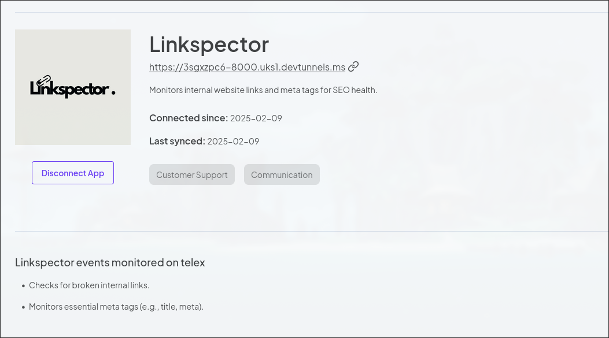
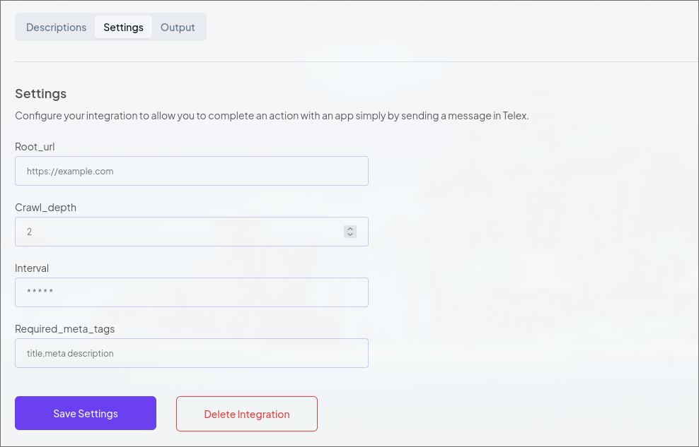
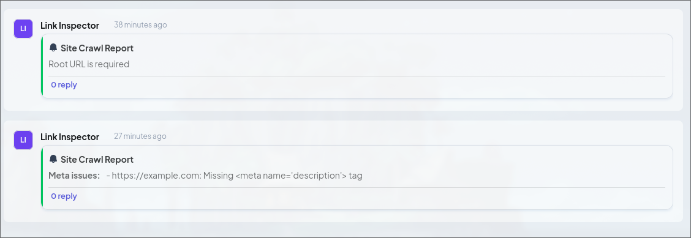

# Link Inspector Integration


Link Inspector is an integration for the Telex platform that monitors internal
website links and meta tags for SEO health. It crawls a website starting from a
user-defined root URL and reports any broken links or meta tag issues back to
Telex via a web hook.

## Features

- Internal Link Check: Crawls the website to detect broken or unreachable
    internal links.
- Meta Tag Monitoring: Checks for the presence of essential meta tags
(e.g., <title\> and meta description) to ensure good SEO practices.
- Configurable Settings: Users can define the root URL, crawl depth, and
required meta tags via the integration settings.
- Interval Integration: Runs periodically based on a user-defined schedule.
- Detailed Reporting: Compiles a report of broken links and meta tag issues,
then sends it to the specified Telex channel.

## Setup

1. Clone the repository.

```bash
git clone https://github.com/yourusername/link-inspector.git
cd link-inspector
```

1. Create and Activate a Virtual Environment:

```bash
python -m venv venv
source venv/bin/activate  # On Windows: venv\Scripts\activate
```

1. Install Dependencies:

```bash
pip install -r requirements.txt
```

1. Run the Application:

```bash
uvicorn main:app --host 0.0.0.0 --port 8000
```

1. Expose Your Local Server (Optional):
If you need your integration accessible via the internet (for Telex testing)
use a tunneling service like Ngrok:

```bash
ngrok http 8000
```

## Sreenshots




